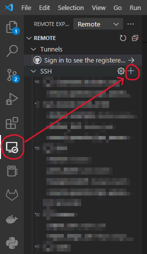
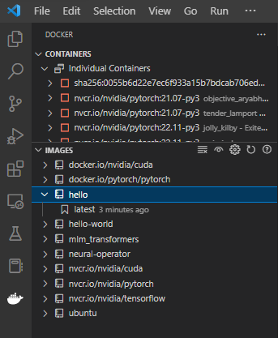

# Arandu User Guide

In this guide, we will provide some examples on how to use C4AI's cluster, Arandu. It is divided in five parts:

- This introduction, which brings an overview of the machine
- Accessing the machine
- Using the Slurm workload manager
- Using the Docker container system
- Examples

All three parts must be used in conjunction for the correct use of the cluster.

## What is a computer cluster

A cluster is a closely connected group of computers that are used to processes large tasks. Each of these individual computers is called a node. Most of the cluster is constituted by "worker" nodes, which are the ones that actually process the tasks. There is also a "master node", or "login node", which acts as the head of the cluster, it receives tasks from users and passes them to the worker nodes depending on their availability.

Arandu has a DGX-A100 as its main processing node, four workstations as auxiliary processing nodes and one master node.

## What is the DGX-A100

The DGX-A100 is a computer system by NVIDIA for AI that contains 8 A100 GPUs, each with 80 GB of working memory. See https://www.nvidia.com/en-us/data-center/dgx-a100/

## Other resources

Besides this guide, we also refer the user to these resources:

- Slurm tutorial: https://slurm.schedmd.com/tutorials.html
- Slurm user guide: https://slurm.schedmd.com/quickstart.html
- Docker tutorial: https://www.docker.com/101-tutorial/
- Docker user guide: https://docs.docker.com/get-started/overview/
- Ufscar's NCC: https://linktr.ee/ufscar.ncc

Feel free to contact the cluster's management team in case of doubts or any other issues.

<!--To-do: add links for contact
-->

# Using the machine

The machines are located in a datacenter at ICMC-USP, all access is done remotely. The machines are behind a Firewall; thus a VPN must be used to connect to their network. Then, access is done via ssh.

<!--To-do: link to the pdf guide
## VPN Access

See the guide in:
-->

## Access by ssh

After connecting to the VPN, the machines will be accessible via ssh. In a terminal, type:

```
ssh myuser@c4aiscm1
```

```c4aiscm1``` is the address of the master node of the cluster.

## VSCode Access

Another way of accessing the cluster is using VSCode. You can add a remote connection and work in remote computers as if they were local. To do so, click in the Remote Explorer button in the sidebar, and add a new remote via ssh.



## File systems

There are two places users can store their files in the cluster, the home folder and the output folder.

Each user's home folder is located at ```/home/[username]```. This folder is shared across all nodes in the cluster, therefore files placed there will be accessible from anywhere. However, network transfer speeds are limited, so it's not recommended running programs directly from this folder, as it may impact the performance for all users in the cluster.

The output folder is local to each worker node, and is located at ```/output/[username]```. We recommend placing all files pertinent to a job in this folder before processing.

The recommended way to do so is by transferring files from the home folder to the output folder at the beginning of a job and, then, transferring the results back when the job finishes. We will cover this in the next session.

**TEMPORARY NOTE**: As of today, Arandu's storage system is not yet installed, therefore storage space is scarce, especially in the home partition. Therefore, as a **temporary solution**, results are to be stored in each node's ```/output``` folder. We will notify users when this issue is resolved.

# Slurm

## What is Slurm?

Slurm is a workload manager. It allows the computational resources available in the cluster to be shared fairly among users. If users require more computational resources than those that are promptly available, Slurm manages a queue of jobs that are started as earlier jobs finish and resources become available.

## Job

A Slurm Job is a unique task that will be sent from the master node to one of the workers, where it can be processed. Jobs can be divided into two categories: interactive and batch.

Interactive jobs are the ones the user can interactively send commands and see their outputs in real time. Batch jobs, on the other hand, have a fixed list of commands that will be given to the worker node.

## Queue

Slurm works with a queue system that distributes the available resources to users on request. In case more resources are requested than those available at a given moment, a queue will be formed, and new jobs will be started as old ones finish.

## Create an interactive job

To start up an interactive job:

```
srun --pty -u bash -i
```

Press ```Ctrl+D``` or type exit to quit the interactive job.

This command starts a bash session in one of the available nodes. In case all nodes are busy, Slurm will add this job to the queue.

Notice in the example below that the host machine changes from the master node ```c4aiscm1``` to the worker ```c4aiscw2```.

```
user@c4aiscm1:~$ srun --pty -u bash -i
srun: job 25 queued and waiting for resources
srun: job 25 has been allocated resources
user@c4aiscw2:/tmp$
```

Different types of resources can be requested when creating a job. For instance, to request a GPU:

```
srun --gres=gpu:1 --pty -u bash -i
```

The cluster is formed of different partitions, each with certain characteristics. When submitting a job, it will be assigned to a fitting partition. One can specify the partition with the ```-p``` argument, for instance:

```
srun -p arandu --pty -u bash -i
```

will necessarily assign this job to the arandu partition, which is the DGX-A100.

## Create a batch job

The ```sbatch``` command is used to create a batch job. It requires a file with arguments to be created. For example, create a file called ```myjob``` with the following content:

```
#!/bin/bash -l

# Set the slurm output file, this is where all command line output is redirected to. %j is replaced by the job id
#SBATCH --output=slurm_out_%j.txt

# Define computational resources. This job requests 8 CPUs and 1 GPU in a single node.
#SBATCH -n 8 # Cores
#SBATCH -N 1 # Number of nodes
#SBATCH --gres=gpu:1

# Sepecify the partition (arandu for the DGX-A100 and devwork for the workstations)
#SBATCH -p arandu

# Print the name of the worker node to the output file
echo "Running on"
hostname

# Copy files from the home folder to the output folder
cp -R /home/[myuser]/[myproject] /output/[myuser]/

# Call Docker and run the code
docker run --user "$(id -u):$(id -g)" --rm -v /output/[myuser]/[myproject]:/workspace/data nvcr.io/nvidia/pytorch:22.11-py3 -w /workspace/data python3 code/main.py

# Move the results to the home folder (Temporarily disabled)
# mv /output/[myuser]/[myproject]/results/* /home/[myuser]/[myproject]/results/

# Clean the output folder
rm -r /output/[myuser]/[myproject]

echo "Done"

```

This code will run the python code in ```/home/[myuser]/[myproject]/code/main.py```. The results of this program should be saved to a ```results``` folder, which will be copied back to the home folder. Notice that we use the ```nvcr.io/nvidia/pytorch:22.11-py3``` Docker image, which was prepared for PyTorch, but other images can be used, as specified in the ```Docker``` session of this document.

## Partitions

Currently, the cluster has the following partitions:

- arandu: This is the DGX-A100
- devwork: These are workstations that are intended to be used for testing programs before submitting to the DGX-A100

## Other guides

See https://slurm.schedmd.com/quickstart.html for more information on how to use Slurm and how to manage jobs.

See https://slurm.schedmd.com/sbatch.html for the available options for batch jobs.

# Docker

## What is Docker?

Docker is a container execution system. A container can be thought of as a self-contained system that brings everything an application needs to run. The advantage of "containerizing" an application is that it can run on different computers without having to reinstall all dependencies in their correct versions, as they are already included in the container. Similarly, a single computer can provide distinct environments for different tasks.

Three concepts are essential to using Docker: "Image", "Container", and "Volume". They will be defined below.

### Image

An image is a package that contains everything it takes to run the application. The application itself and all its dependencies in its correct versions are contained in the image.

Docker operates with an image layering system. In this way, a new image can be defined as a previous image added to the new elements.

### Container

The container is a running image. Each image can be initialized more than once, with distinct parameters.

### Volume

The volume is a mechanism for storing and exchanging data from a container. Files saved to a volume during the execution of a container will be retained after it is finalized.

## Image, container, and volume management

The Docker system is already installed on the machine. To use it, you need the command: ``docker`` and its arguments. In this guide, we will create a simple example that will use the concepts of image, container, and volume.

## Starting a container

To start a container from an image, you use the ```docker``` run command, for example:

```
docker run -it --rm nvcr.io/nvidia/pytorch:22.11-py3
```

In this case, we use four different flags: ``i``, ``t`` and ``rm``. The first two are commonly used together. ``i`` means ``interactive`` and ``t``, ``tty``. The two together make the container run interactively and with a terminal. The ``rm`` flag indicates that the container should be deleted at the end of execution. In many cases, this is a good practice to prevent the accumulation of unused containers.

When using this command, a container is created from the ``nvcr.io/nvidia/pytorch:22.11-py3`` image and opened. At this point, the command line will be connected to the container. The terminal will be in the workspace folder. Use the ``ls`` command to explore the contents of the folder. This image is developed by NVIDIA especially for systems such as the DGX-A100, note that the folder already contains some examples and usage guides.

To end the image, press ``Ctrl+D``.

This container environment brings several pre-installed tools for machine learning. This, in particular, has PyTorch pre-installed, but there are versions with other toolkits, such as Tensorflow.

There is a catalog of these images on https://docs.nvidia.com/deeplearning/frameworks/support-matrix/index.html. Note that the number at the end of the name indicates the version, which in this case is given by the year and month of its creation.

Note that this example container will have no access to the host's GPUs. For this, we must use the ``gpus`` flag. For instance, if we use ``--gpus 2``, the container will have access to two GPUs. However, these GPUs may not be those designated by Slurm to our job, which may cause conflicts with jobs by other users. To correctly assign GPUs to a container, the command should be ``--gpus \"device=$CUDA_VISIBLE_DEVICES\"``.

Docker's default setting is to run as root in the host machine, this causes all files created by it to be owned by root, therefore read-only for other users. This can be fixed by specifying the correct user and group IDs when starting up a container with the flag: ```--user "$(id -u):$(id -g)"```

Therefore, in the above example, the command becomes

```
docker run --user "$(id -u):$(id -g)" -it --rm --gpus \"device=$CUDA_VISIBLE_DEVICES\" nvcr.io/nvidia/pytorch:22.11-py3
```

### Creating an image

You can create new images for Docker based on existing images. An image is generated from a Dockerfile file located in the same directory as the main application.

In our example, we have a simple Python file that writes "Hello world" on the screen. The name of this file is ``helloworld.py``, and we want to create an image to run this code.

```
print("Hello world")
```

Let's create the ``Dockerfile`` that will make an image from this file. The file name should be ` `Dockerfile`` and its contents; in this example, it is:

```
FROM nvcr.io/nvidia/pytorch:22.11-py3
COPY . .
```

The first line, with the keyword ``FROM``, selects an image to use as a base. In our case, we will use the image ``nvcr.io/nvidia/pytorch:22.11-py3``.

The second line, with the keyword ``COPY``, makes a copy of the files from the current directory into the image. In our example, the only copied file is ``helloworld.py``.

Finally, to create the image, we use the command:

```
docker build . -t hello
```

The ``-t`` key defines the name given to the image. Note that on some systems, such as Arandu, Docker runs as root, so images are shared among users.

A simple way to manage images on a system is to use the Docker extension for VSCode. The image below shows an example, with the containers at the top and the images at the bottom. Note that the ``hello` image is in the list. The arrow to the left of the image name lets you see the installed versions of this image.



With this, we can open our new image with the command

```
docker run -it --rm hello
```

You can also create a container that executes a command as soon as it is opened. For this, we use the keyword ``ENTRYPOINT``. The Dockerfile looks like this:

```
FROM nvcr.io/nvidia/pytorch:22.11-py3
COPY. .
ENTRYPOINT ["python3", "helloworld.py"]
```

This time, when the container starts, it will run the script and close.

## Using volumes

A Docker container runs in a file system that is separate to that of the host machine. To exchange files between the container and the host, a volume can be used. It links a directory in the container to one in the host.

In the Slurm example above, we have used the flag

```
-v /output/[myuser]/[myproject]:/workspace/data
```

This flag links the ```/output/[myuser]/[myproject]``` folder in the host to the ```/workspace/data``` folder in the container.

```/workspace``` is the default folder the Docker container opens in. In our example, this was changed by the ```-w /workspace/data``` flag.

# Examples
## Starting a Jupyter server in Arandu

In this example, we will use Slurm to allocate a GPU in the DGX-A100 and start a Jupyter server in a Docker container

### Connecting to the server

After connecting to the VPN, open a terminal and type

```
ssh myuser@c4aiscm1
```

It will prompt your password, after that, you'll be connected to the master node of the cluster.

Now, to request a GPU in the DGX-A100, type

```
srun -p arandu --gres=gpu:1 --pty -u bash -i
```

If a GPU is available, you will be connected to the dgx01 node. If not, you will be placed in the queue.

To start a Docker container, type

```
sudo docker run --user "$(id -u):$(id -g)" --gpus \"device=$CUDA_VISIBLE_DEVICES\" -p 8888:8888 --rm -it nvcr.io/nvidia/pytorch:22.11-py3
```

The ```-p 8888:8888``` argument maps the 8888 network port in the container to the dgx01's 8888 port, which is used for Jupyter.

The Docker container will open, to start the Jupyter server, type

```
jupyter notebook --ip=0.0.0.0 --port=8888 --no-browser &
```

The output will look like this:

```
root@1632efb76d1d:/workspace# [I 15:00:20.897 NotebookApp] JupyterLab extension loaded from /usr/local/lib/python3.5/dist-packages/jupyterlab
[I 15:00:20.897 NotebookApp] JupyterLab application directory is /usr/local/share/jupyter/lab
[I 15:00:20.898 NotebookApp] Serving notebooks from local directory: /workspace
[I 15:00:20.898 NotebookApp] The Jupyter Notebook is running at:
[I 15:00:20.898 NotebookApp] http://(1632efb76d1d or 127.0.0.1):8888/?token=fbf41b0ae5465f6435d67137983ee13a9df66e52268ba1d6
[I 15:00:20.898 NotebookApp] Use Control-C to stop this server and shut down all kernels (twice to skip confirmation).
[C 15:00:20.901 NotebookApp]

    To access the notebook, open this file in a browser:
        file:///root/.local/share/jupyter/runtime/nbserver-67-open.html
    Or copy and paste one of these URLs:
        http://(1632efb76d1d or 127.0.0.1):8888/?token=fbf41b0ae5465f6435d67137983ee13a9df66e52268ba1d6
```

Notice the last line in the output, it contains the token for accessing the notebook, in this case: ```fbf41b0ae5465f6435d67137983ee13a9df66e52268ba1d6```

Finally, on your computer, open a web browser and access (replace ```[TOKEN]``` by your token from the previous command).

```
dgx01:8888/?token=[TOKEN]
```

To simplify the execution, all commands can be chained in a bash script. To do this, create a new file called ```startjupyter.sh``` with the following contents

```
#!/bin/bash
srun -p arandu --pty -u docker run --user "$(id -u):$(id -g)" --gpus \"device=$CUDA_VISIBLE_DEVICES\" -p 8888:8888 --rm -it nvcr.io/nvidia/pytorch:22.11-py3 -c jupyter notebook --allow-root --ip=0.0.0.0 --port=8888 --no-browser
```

To make it an executable, run

```
chmod 755 startjupyter.sh
```

Finally, to start the server, run

```
./startjupyter.sh
```

## Training a neural network as a background job

First, connect to the master node, as was done in the previous example.

Create a folder called ```background_job```, which contains two directories: ```code``` and ```models```.

In the ```code``` directory, create a python file called ```main.py``` with the following content:

This example was adapted from: https://pytorch.org/tutorials/beginner/pytorch_with_examples.html


```
import torch
import math


# Create Tensors to hold input and outputs.
x = torch.linspace(-math.pi, math.pi, 2000)
y = torch.sin(x)

# Prepare the input tensor (x, x^2, x^3).
p = torch.tensor([1, 2, 3])
xx = x.unsqueeze(-1).pow(p)

# Use the nn package to define our model and loss function.
model = torch.nn.Sequential(
    torch.nn.Linear(3, 1),
    torch.nn.Flatten(0, 1)
)
loss_fn = torch.nn.MSELoss(reduction='sum')

# Use the optim package to define an Optimizer that will update the weights of
# the model for us. Here we will use RMSprop; the optim package contains many other
# optimization algorithms. The first argument to the RMSprop constructor tells the
# optimizer which Tensors it should update.
learning_rate = 1e-3
optimizer = torch.optim.RMSprop(model.parameters(), lr=learning_rate)
for t in range(2000):
    # Forward pass: compute predicted y by passing x to the model.
    y_pred = model(xx)

    # Compute and print loss.
    loss = loss_fn(y_pred, y)
    if t % 100 == 99:
        print(t, loss.item())

    # Before the backward pass, use the optimizer object to zero all of the
    # gradients for the variables it will update (which are the learnable
    # weights of the model). This is because by default, gradients are
    # accumulated in buffers( i.e, not overwritten) whenever .backward()
    # is called. Checkout docs of torch.autograd.backward for more details.
    optimizer.zero_grad()

    # Backward pass: compute gradient of the loss with respect to model
    # parameters
    loss.backward()

    # Calling the step function on an Optimizer makes an update to its
    # parameters
    optimizer.step()


linear_layer = model[0]
print(f'Result: y = {linear_layer.bias.item()} + {linear_layer.weight[:, 0].item()} x + {linear_layer.weight[:, 1].item()} x^2 + {linear_layer.weight[:, 2].item()} x^3')

torch.save(model, 'models/trained_model.pt')
```

Running this code trains a simple neural network to approximate a sine function. For the sake of simplicity, we do not use the GPU in this example.

Now, create a file called ```train_model``` in the ```background_job``` folder with the following content:

```
#!/bin/bash -l

# Set the slurm output file, this is where all command line output is redirected to. %j is replaced by the job id
#SBATCH --output=slurm_out_%j.txt

# Define computational resources. This job requests 8 CPUs and 1 GPU in a single node.
#SBATCH -n 8 # Cores
#SBATCH -N 1 # Number of nodes
#SBATCH --gres=gpu:1

# Sepecify the partition (arandu for the DGX-A100 and devwork for the workstations)
#SBATCH -p devwork

# Print the name of the worker node to the output file
echo "Running on"
hostname

# Copy files from the home folder to the output folder
cp -R /home/[myuser]/background_job /output/[myuser]/

# Call Docker and run the code
docker run --user "$(id -u):$(id -g)" --rm --gpus \"device=$CUDA_VISIBLE_DEVICES\" -v /output/[myuser]/background_job:/workspace/data -w /workspace/data nvcr.io/nvidia/pytorch:22.11-py3 \
 python3 code/main.py

# Move the results to the home folder (Temporarily disabled)
# mv /output/[myuser]/background_job/results/* /home/[myuser]/background_job/results/

# Clean the output folder
rm -r /output/[myuser]/background_job

echo "Done"

```

Now, call Slurm in batch mode using this file.

```
sbatch train_model
```

If all goes well, Slurm will place this job in the queue for one of the workstations and run it when there are resources available. The job's output can be monitored in the ```slurm_out_%j.txt``` file. The ```squeue``` command can be used to check the job's status before it is finished.